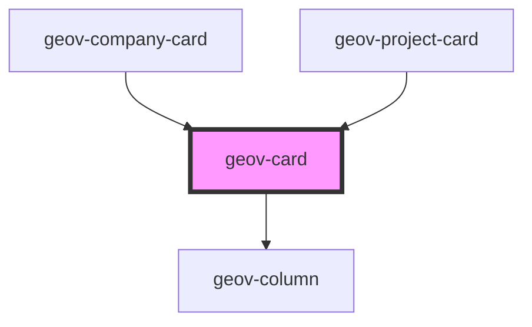

# geov-card

<!-- Auto Generated Below -->

## Properties

| Property  | Attribute | Description | Type                                                                | Default     |
| --------- | --------- | ----------- | ------------------------------------------------------------------- | ----------- |
| `height`  | `height`  |             | `string`                                                            | `undefined` |
| `justify` | `justify` |             | `"center" \| "end" \| "space-around" \| "space-between" \| "start"` | `'center'`  |
| `width`   | `width`   |             | `string`                                                            | `undefined` |

## Dependencies

### Used by

 - [geov-company-card](../geov-company-card)
 - [geov-project-card](../geov-project-card)

### Depends on

- [geov-column](../../grid/geov-column)

### Graph

----------------------------------------------

*Built with [StencilJS](https://stenciljs.com/)*
