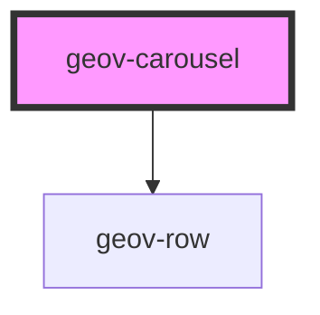

# geov-carousel

<!-- Auto Generated Below -->

## Properties

| Property     | Attribute    | Description | Type     | Default     |
| ------------ | ------------ | ----------- | -------- | ----------- |
| `height`     | `height`     |             | `string` | `undefined` |
| `interval`   | `interval`   |             | `number` | `5000`      |
| `transition` | `transition` |             | `number` | `1000`      |
| `width`      | `width`      |             | `string` | `undefined` |

## Dependencies

### Depends on

- [geov-row](../../grid/geov-row)

### Graph

----------------------------------------------

*Built with [StencilJS](https://stenciljs.com/)*
