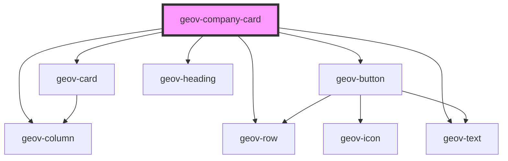

# geov-company-card

<!-- Auto Generated Below -->

## Properties

| Property      | Attribute     | Description | Type     | Default     |
| ------------- | ------------- | ----------- | -------- | ----------- |
| `description` | `description` |             | `string` | `undefined` |
| `imageUrl`    | `image-url`   |             | `string` | `undefined` |
| `name`        | `name`        |             | `string` | `undefined` |
| `websiteUrl`  | `website-url` |             | `string` | `undefined` |

## Dependencies

### Depends on

- [geov-card](../geov-card)
- [geov-row](../../grid/geov-row)
- [geov-button](../../basic/geov-button)
- [geov-heading](../../basic/geov-heading)
- [geov-column](../../grid/geov-column)
- [geov-text](../../basic/geov-text)

### Graph

----------------------------------------------

*Built with [StencilJS](https://stenciljs.com/)*
