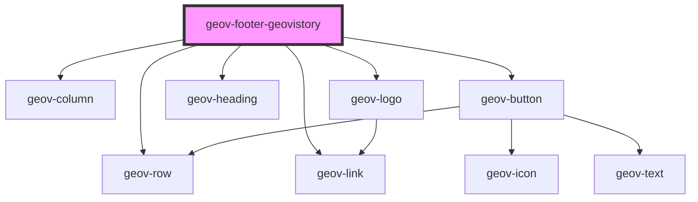

# geov-footer-geovistory

<!-- Auto Generated Below -->

## Properties

| Property           | Attribute           | Description | Type     | Default     |
| ------------------ | ------------------- | ----------- | -------- | ----------- |
| `featuredProjects` | `featured-projects` |             | `string` | `undefined` |
| `geovStyle`        | `geov-style`        |             | `string` | `''`        |

## Dependencies

### Depends on

- [geov-row](../../grid/geov-row)
- [geov-column](../../grid/geov-column)
- [geov-logo](../../basic/geov-logo)
- [geov-heading](../../basic/geov-heading)
- [geov-button](../../basic/geov-button)
- [geov-link](../../basic/geov-link)

### Graph

----------------------------------------------

*Built with [StencilJS](https://stenciljs.com/)*
