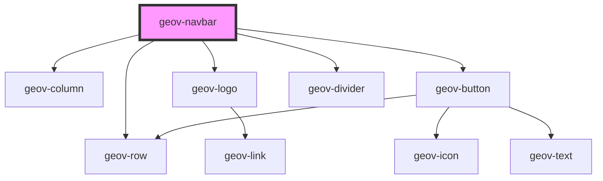

# geov-navbar

<!-- Auto Generated Below -->

## Properties

| Property     | Attribute    | Description | Type     | Default     |
| ------------ | ------------ | ----------- | -------- | ----------- |
| `geovStyle`  | `geov-style` |             | `string` | `''`        |
| `height`     | `height`     |             | `string` | `undefined` |
| `links`      | `links`      |             | `string` | `undefined` |
| `login`      | `login`      |             | `string` | `undefined` |
| `login_href` | `login_href` |             | `string` | `undefined` |
| `logo`       | `logo`       |             | `string` | `undefined` |

## Dependencies

### Depends on

- [geov-row](../../grid/geov-row)
- [geov-column](../../grid/geov-column)
- [geov-logo](../../basic/geov-logo)
- [geov-button](../../basic/geov-button)
- [geov-divider](../../basic/geov-divider)

### Graph

----------------------------------------------

*Built with [StencilJS](https://stenciljs.com/)*
