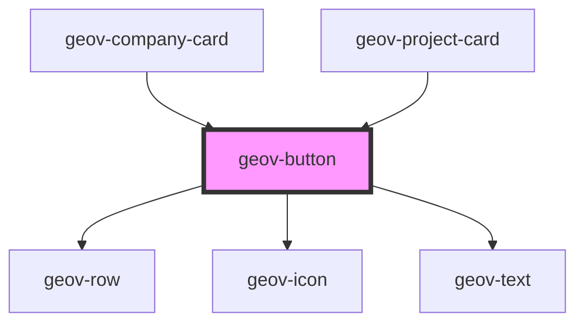

# geov-button

<!-- Auto Generated Below -->

## Properties

| Property   | Attribute   | Description | Type                                  | Default     |
| ---------- | ----------- | ----------- | ------------------------------------- | ----------- |
| `href`     | `href`      |             | `string`                              | `undefined` |
| `icon`     | `icon`      |             | `"arrow-right" \| "github" \| "link"` | `undefined` |
| `iconPos`  | `icon-pos`  |             | `"end" \| "start"`                    | `'start'`   |
| `iconSize` | `icon-size` |             | `"large" \| "medium" \| "small"`      | `'medium'`  |
| `rounded`  | `rounded`   |             | `boolean`                             | `undefined` |
| `variant`  | `variant`   |             | `"ghost" \| "outline" \| "solid"`     | `'solid'`   |

## Dependencies

### Used by

 - [geov-company-card](../../advanced/geov-company-card)
 - [geov-project-card](../../advanced/geov-project-card)

### Depends on

- [geov-row](../../grid/geov-row)
- [geov-icon](../geov-icon)
- [geov-text](../geov-text)

### Graph

----------------------------------------------

*Built with [StencilJS](https://stenciljs.com/)*
