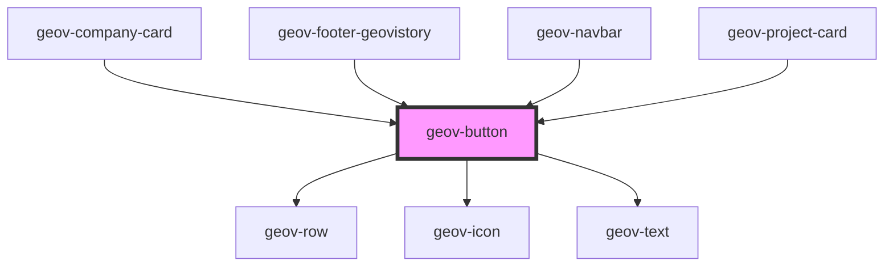

# geov-button

<!-- Auto Generated Below -->

## Properties

| Property    | Attribute    | Description | Type      | Default |
| ----------- | ------------ | ----------- | --------- | ------- |
| `geovStyle` | `geov-style` |             | `string`  | `''`    |
| `ghost`     | `ghost`      |             | `boolean` | `false` |
| `href`      | `href`       |             | `string`  | `''`    |
| `leftIcon`  | `left-icon`  |             | `string`  | `''`    |
| `outline`   | `outline`    |             | `boolean` | `false` |
| `rightIcon` | `right-icon` |             | `string`  | `''`    |
| `rounded`   | `rounded`    |             | `boolean` | `false` |
| `solid`     | `solid`      |             | `boolean` | `false` |

## Dependencies

### Used by

 - [geov-company-card](../../advanced/geov-company-card)
 - [geov-footer-geovistory](../../advanced/geov-footer-geovistory)
 - [geov-navbar](../../advanced/geov-navbar)
 - [geov-project-card](../../advanced/geov-project-card)

### Depends on

- [geov-row](../../grid/geov-row)
- [geov-icon](../geov-icon)
- [geov-text](../geov-text)

### Graph

```mermaid
graph TD;
  geov-button --> geov-row
  geov-button --> geov-icon
  geov-button --> geov-text
  geov-company-card --> geov-button
  geov-footer-geovistory --> geov-button
  geov-navbar --> geov-button
  geov-project-card --> geov-button
  style geov-button fill:#f9f,stroke:#333,stroke-width:4px
```

----------------------------------------------

*Built with [StencilJS](https://stenciljs.com/)*
