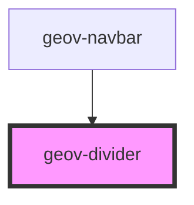

# geov-divider

<!-- Auto Generated Below -->

## Properties

| Property     | Attribute    | Description | Type      | Default     |
| ------------ | ------------ | ----------- | --------- | ----------- |
| `geovStyle`  | `geov-style` |             | `string`  | `''`        |
| `height`     | `height`     |             | `string`  | `undefined` |
| `horizontal` | `horizontal` |             | `boolean` | `undefined` |
| `vertical`   | `vertical`   |             | `boolean` | `undefined` |
| `width`      | `width`      |             | `string`  | `undefined` |

## Dependencies

### Used by

 - [geov-navbar](../../advanced/geov-navbar)

### Graph

----------------------------------------------

*Built with [StencilJS](https://stenciljs.com/)*
