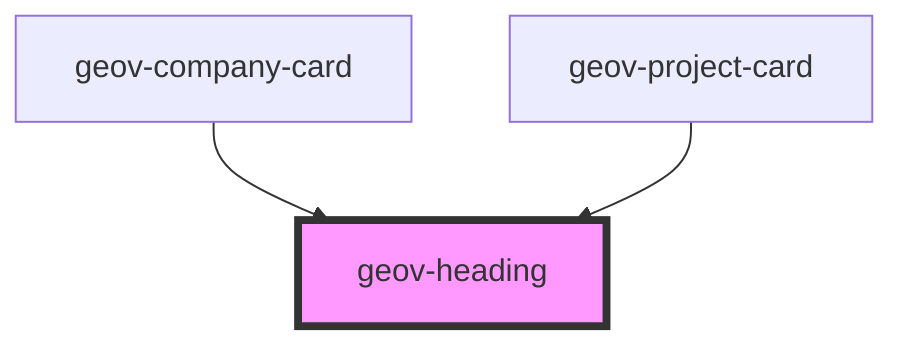

# geov-heading

<!-- Auto Generated Below -->

## Properties

| Property  | Attribute | Description | Type                   | Default |
| --------- | --------- | ----------- | ---------------------- | ------- |
| `variant` | `variant` |             | `"h1" \| "h2" \| "h3"` | `'h1'`  |

## Dependencies

### Used by

 - [geov-company-card](../../advanced/geov-company-card)
 - [geov-project-card](../../advanced/geov-project-card)

### Graph

----------------------------------------------

*Built with [StencilJS](https://stenciljs.com/)*
