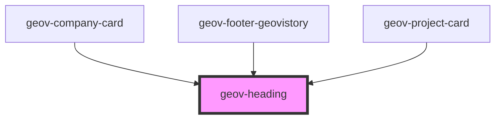

# geov-heading

<!-- Auto Generated Below -->

## Properties

| Property    | Attribute    | Description | Type      | Default |
| ----------- | ------------ | ----------- | --------- | ------- |
| `geovStyle` | `geov-style` |             | `string`  | `''`    |
| `h1`        | `h-1`        |             | `boolean` | `false` |
| `h2`        | `h-2`        |             | `boolean` | `false` |
| `h3`        | `h-3`        |             | `boolean` | `false` |
| `light`     | `light`      |             | `boolean` | `false` |

## Dependencies

### Used by

 - [geov-company-card](../../advanced/geov-company-card)
 - [geov-footer-geovistory](../../advanced/geov-footer-geovistory)
 - [geov-project-card](../../advanced/geov-project-card)

### Graph

```mermaid
graph TD;
  geov-company-card --> geov-heading
  geov-footer-geovistory --> geov-heading
  geov-project-card --> geov-heading
  style geov-heading fill:#f9f,stroke:#333,stroke-width:4px
```

----------------------------------------------

*Built with [StencilJS](https://stenciljs.com/)*
