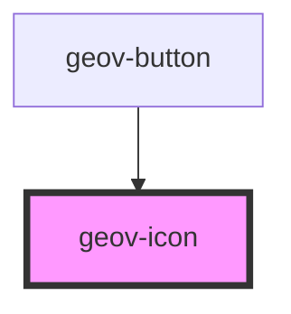

# geov-icon

<!-- Auto Generated Below -->

## Properties

| Property | Attribute | Description | Type                                  | Default     |
| -------- | --------- | ----------- | ------------------------------------- | ----------- |
| `name`   | `name`    |             | `"arrow-right" \| "github" \| "link"` | `undefined` |
| `size`   | `size`    |             | `"large" \| "medium" \| "small"`      | `'medium'`  |

## Dependencies

### Used by

 - [geov-button](../geov-button)

### Graph

----------------------------------------------

*Built with [StencilJS](https://stenciljs.com/)*
