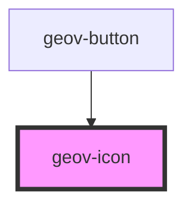

# geov-icon

<!-- Auto Generated Below -->

## Properties

| Property     | Attribute     | Description | Type      | Default |
| ------------ | ------------- | ----------- | --------- | ------- |
| `arrowRight` | `arrow-right` |             | `boolean` | `false` |
| `geovStyle`  | `geov-style`  |             | `string`  | `''`    |
| `github`     | `github`      |             | `boolean` | `false` |
| `large`      | `large`       |             | `boolean` | `false` |
| `link`       | `link`        |             | `boolean` | `false` |
| `medium`     | `medium`      |             | `boolean` | `false` |
| `small`      | `small`       |             | `boolean` | `false` |

## Dependencies

### Used by

 - [geov-button](../geov-button)

### Graph

```mermaid
graph TD;
  geov-button --> geov-icon
  style geov-icon fill:#f9f,stroke:#333,stroke-width:4px
```

----------------------------------------------

*Built with [StencilJS](https://stenciljs.com/)*
