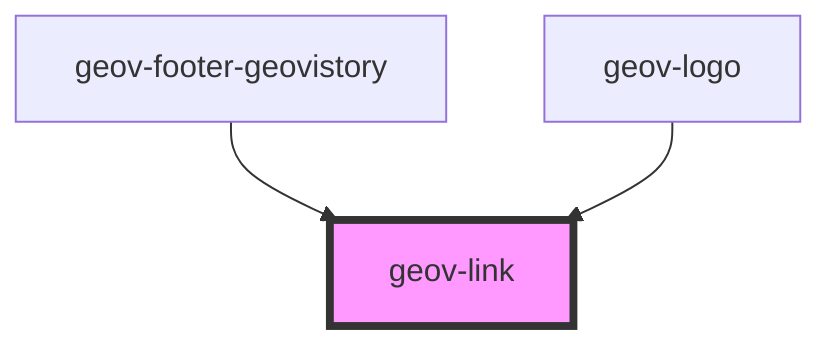

# geov-link

<!-- Auto Generated Below -->

## Properties

| Property    | Attribute    | Description | Type      | Default     |
| ----------- | ------------ | ----------- | --------- | ----------- |
| `geovStyle` | `geov-style` |             | `string`  | `''`        |
| `grey`      | `grey`       |             | `boolean` | `undefined` |
| `href`      | `href`       |             | `string`  | `undefined` |
| `light`     | `light`      |             | `boolean` | `undefined` |

## Dependencies

### Used by

 - [geov-footer-geovistory](../../advanced/geov-footer-geovistory)
 - [geov-logo](../geov-logo)

### Graph

----------------------------------------------

*Built with [StencilJS](https://stenciljs.com/)*
