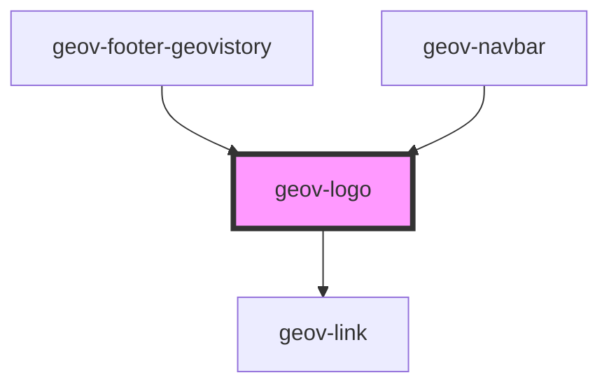

# geov-logo

<!-- Auto Generated Below -->

## Properties

| Property          | Attribute          | Description | Type      | Default |
| ----------------- | ------------------ | ----------- | --------- | ------- |
| `geovStyle`       | `geov-style`       |             | `string`  | `''`    |
| `geovistory`      | `geovistory`       |             | `boolean` | `false` |
| `geovistoryWhite` | `geovistory-white` |             | `boolean` | `false` |

## Dependencies

### Used by

 - [geov-footer-geovistory](../../advanced/geov-footer-geovistory)
 - [geov-navbar](../../advanced/geov-navbar)

### Depends on

- [geov-link](../geov-link)

### Graph

----------------------------------------------

*Built with [StencilJS](https://stenciljs.com/)*
