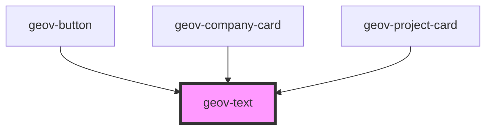

# geov-text

<!-- Auto Generated Below -->

## Properties

| Property  | Attribute | Description | Type                                                 | Default     |
| --------- | --------- | ----------- | ---------------------------------------------------- | ----------- |
| `justify` | `justify` |             | `"center" \| "left" \| "start"`                      | `undefined` |
| `variant` | `variant` |             | `"caption" \| "description" \| "subtitle" \| "text"` | `undefined` |

## Dependencies

### Used by

 - [geov-button](../geov-button)
 - [geov-company-card](../../advanced/geov-company-card)
 - [geov-project-card](../../advanced/geov-project-card)

### Graph

----------------------------------------------

*Built with [StencilJS](https://stenciljs.com/)*
