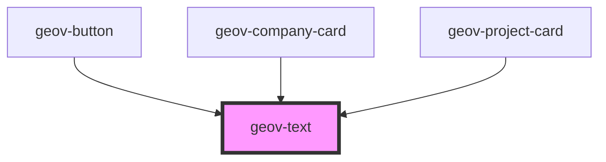

# geov-text

<!-- Auto Generated Below -->

## Properties

| Property      | Attribute     | Description | Type      | Default |
| ------------- | ------------- | ----------- | --------- | ------- |
| `caption`     | `caption`     |             | `boolean` | `false` |
| `center`      | `center`      |             | `boolean` | `false` |
| `description` | `description` |             | `boolean` | `false` |
| `end`         | `end`         |             | `boolean` | `false` |
| `geovStyle`   | `geov-style`  |             | `string`  | `''`    |
| `light`       | `light`       |             | `boolean` | `false` |
| `start`       | `start`       |             | `boolean` | `false` |
| `subtitle`    | `subtitle`    |             | `boolean` | `false` |
| `text`        | `text`        |             | `boolean` | `false` |

## Dependencies

### Used by

 - [geov-button](../geov-button)
 - [geov-company-card](../../advanced/geov-company-card)
 - [geov-project-card](../../advanced/geov-project-card)

### Graph

```mermaid
graph TD;
  geov-button --> geov-text
  geov-company-card --> geov-text
  geov-project-card --> geov-text
  style geov-text fill:#f9f,stroke:#333,stroke-width:4px
```

----------------------------------------------

*Built with [StencilJS](https://stenciljs.com/)*
