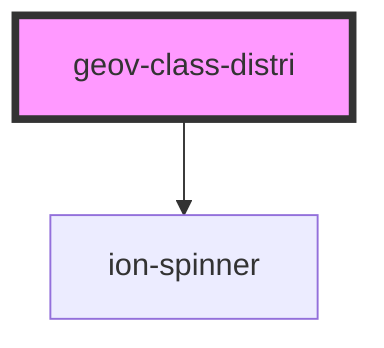

# geov-class-distri

<!-- Auto Generated Below -->

## Properties

| Property         | Attribute         | Description                               | Type     | Default     |
| ---------------- | ----------------- | ----------------------------------------- | -------- | ----------- |
| `height`         | `height`          | Size in pixel of the final chart          | `number` | `undefined` |
| `sparqlEndpoint` | `sparql-endpoint` | sparqlEndpoint URL of the sparql endpoint | `string` | `undefined` |
| `width`          | `width`           | Size in pixel of the final chart          | `number` | `undefined` |

## Dependencies

### Depends on

- ion-spinner

### Graph

----------------------------------------------

*Built with [StencilJS](https://stenciljs.com/)*
