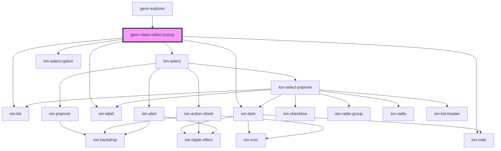

# geov-class-radio-group

<!-- Auto Generated Below -->

## Properties

| Property    | Attribute | Description | Type                    | Default     |
| ----------- | --------- | ----------- | ----------------------- | ----------- |
| `initValue` | --        |             | `GeovClassSelectItem`   | `undefined` |
| `items`     | --        |             | `GeovClassSelectItem[]` | `undefined` |

## Events

| Event              | Description | Type                                     |
| ------------------ | ----------- | ---------------------------------------- |
| `selectionChanged` |             | `CustomEvent<GeovClassSelectPopupEvent>` |

## Dependencies

### Used by

 - [geov-explorer](../geov-explorer)

### Depends on

- ion-list
- ion-item
- ion-note
- ion-select
- ion-select-option
- ion-label

### Graph

----------------------------------------------

*Built with [StencilJS](https://stenciljs.com/)*
