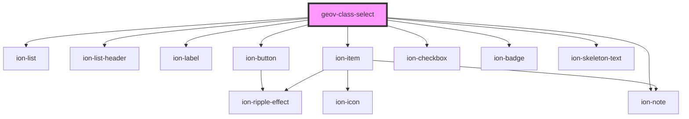

# geov-class-select

<!-- Auto Generated Below -->

## Properties

| Property        | Attribute         | Description                                                            | Type                    | Default     |
| --------------- | ----------------- | ---------------------------------------------------------------------- | ----------------------- | ----------- |
| `checkedOnInit` | `checked-on-init` | If true, the classes are checked on init, else none is checked on init | `boolean`               | `true`      |
| `items`         | --                |                                                                        | `GeovClassSelectItem[]` | `undefined` |
| `loading`       | `loading`         |                                                                        | `boolean`               | `undefined` |

## Events

| Event              | Description | Type                            |
| ------------------ | ----------- | ------------------------------- |
| `selectionChanged` |             | `CustomEvent<ClassSelectEvent>` |

## Dependencies

### Depends on

- ion-list
- ion-list-header
- ion-label
- ion-button
- ion-item
- ion-note
- ion-checkbox
- ion-badge
- ion-skeleton-text

### Graph

----------------------------------------------

*Built with [StencilJS](https://stenciljs.com/)*
