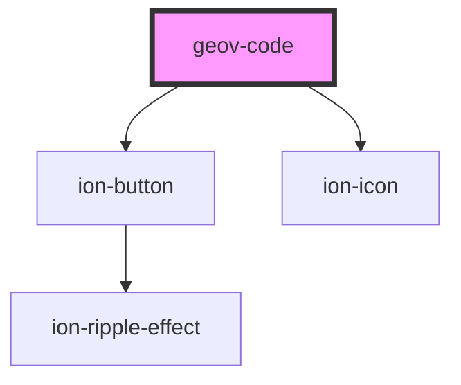

# geov-code

<!-- Auto Generated Below -->

## Properties

| Property     | Attribute     | Description | Type                                                                                                                                                                                                                                                      | Default     |
| ------------ | ------------- | ----------- | --------------------------------------------------------------------------------------------------------------------------------------------------------------------------------------------------------------------------------------------------------- | ----------- |
| `code`       | `code`        |             | `string`                                                                                                                                                                                                                                                  | `undefined` |
| `copyButton` | `copy-button` |             | `boolean`                                                                                                                                                                                                                                                 | `true`      |
| `language`   | `language`    |             | `"markup" \| "html" \| "xml" \| "css" \| "clike" \| "javascript" \| "bash" \| "git" \| "http" \| "ignore" \| "json" \| "json5" \| "plsql" \| "python" \| "jsx" \| "tsx" \| "sass" \| "scss" \| "sparql" \| "sql" \| "turtle" \| "typescript" \| "xquery"` | `undefined` |

## Dependencies

### Depends on

- ion-button
- ion-icon

### Graph

----------------------------------------------

*Built with [StencilJS](https://stenciljs.com/)*
