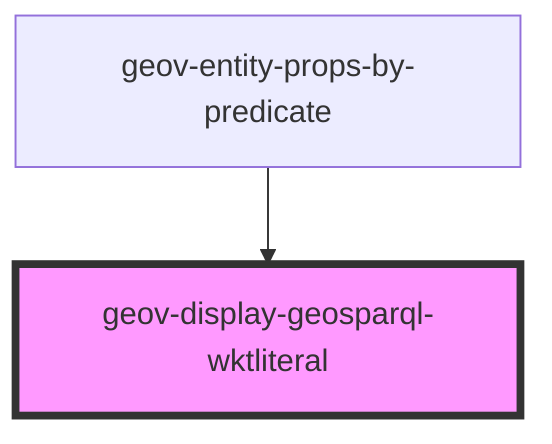

# geov-display-geosparql-wktliteral

<!-- Auto Generated Below -->

## Properties

| Property | Attribute | Description       | Type     | Default     |
| -------- | --------- | ----------------- | -------- | ----------- |
| `value`  | `value`   | the opengis value | `string` | `undefined` |

## Dependencies

### Used by

 - [geov-entity-props-by-predicate](../geov-entity-props-by-predicate)

### Graph

----------------------------------------------

*Built with [StencilJS](https://stenciljs.com/)*
