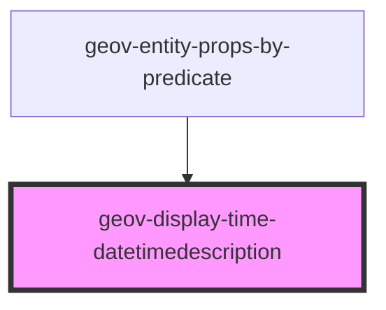

# geov-display-time-datetimedescription

<!-- Auto Generated Below -->

## Properties

| Property         | Attribute         | Description                               | Type     | Default     |
| ---------------- | ----------------- | ----------------------------------------- | -------- | ----------- |
| `entityId`       | `entity-id`       | entityId ID number of entity, e.g. 'iXXX' | `string` | `undefined` |
| `sparqlEndpoint` | `sparql-endpoint` | sparqlEndpoint URL of the sparql endpoint | `string` | `undefined` |

## Dependencies

### Used by

 - [geov-entity-props-by-predicate](../geov-entity-props-by-predicate)

### Graph

----------------------------------------------

*Built with [StencilJS](https://stenciljs.com/)*
