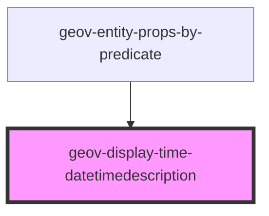

# geov-display-time-datetimedescription

<!-- Auto Generated Below -->

## Properties

| Property            | Attribute             | Description                                                                                                                                                                          | Type      | Default     |
| ------------------- | --------------------- | ------------------------------------------------------------------------------------------------------------------------------------------------------------------------------------ | --------- | ----------- |
| `_ssrId`            | `_ssr-id`             | _ssrId is short for server side rendering id and identifies this component and the fetched data respectively. Set this only if you want to enable this component to fetch serve side | `string`  | `undefined` |
| `entityId`          | `entity-id`           | entityId ID number of entity, e.g. 'iXXX'                                                                                                                                            | `string`  | `undefined` |
| `fetchBeforeRender` | `fetch-before-render` |                                                                                                                                                                                      | `boolean` | `true`      |
| `sparqlEndpoint`    | `sparql-endpoint`     | sparqlEndpoint URL of the sparql endpoint                                                                                                                                            | `string`  | `undefined` |

## Methods

### `fetchData() => Promise<DateData>`

Do the sparql request(s)

#### Returns

Type: `Promise<DateData>`

a Promise with the data for this component

## Dependencies

### Used by

 - [geov-entity-props-by-predicate](../geov-entity-props-by-predicate)

### Graph

----------------------------------------------

*Built with [StencilJS](https://stenciljs.com/)*
