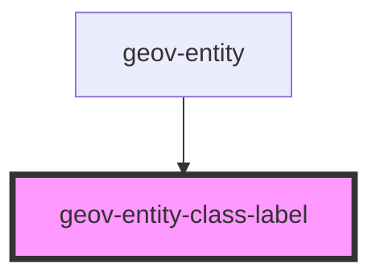

# geov-entity-class-label

<!-- Auto Generated Below -->

## Properties

| Property         | Attribute         | Description                                  | Type     | Default     |
| ---------------- | ----------------- | -------------------------------------------- | -------- | ----------- |
| `_ssrId`         | `_ssr-id`         |                                              | `string` | `undefined` |
| `entityId`       | `entity-id`       | entityId ID number of entity, e.g. 'i315800' | `string` | `undefined` |
| `sparqlEndpoint` | `sparql-endpoint` | sparqlEndpoint URL of the sparql endpoint    | `string` | `undefined` |

## Dependencies

### Used by

 - [geov-entity](../geov-entity)

### Graph

----------------------------------------------

*Built with [StencilJS](https://stenciljs.com/)*
