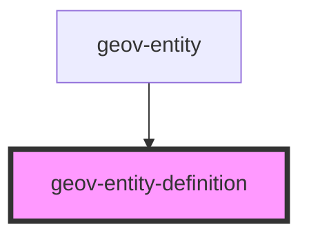

# geov-entity-definition

<!-- Auto Generated Below -->

## Properties

| Property           | Attribute           | Description                                         | Type     | Default     |
| ------------------ | ------------------- | --------------------------------------------------- | -------- | ----------- |
| `_ssrId`           | `_ssr-id`           |                                                     | `string` | `undefined` |
| `emptyPlaceholder` | `empty-placeholder` | text to be displayed in case no definition is found | `string` | `''`        |
| `entityId`         | `entity-id`         | entityId ID number of entity, e.g. 'i315800'        | `string` | `undefined` |
| `sparqlEndpoint`   | `sparql-endpoint`   | sparqlEndpoint URL of the sparql endpoint           | `string` | `undefined` |

## Dependencies

### Used by

 - [geov-entity](../geov-entity)

### Graph

----------------------------------------------

*Built with [StencilJS](https://stenciljs.com/)*
