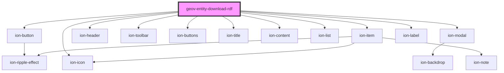

# geov-entity-download-rdf

<!-- Auto Generated Below -->

## Properties

| Property      | Attribute      | Description                                  | Type                                           | Default              |
| ------------- | -------------- | -------------------------------------------- | ---------------------------------------------- | -------------------- |
| `buttonIcon`  | `button-icon`  | buttonIcon Icon of the button                | `string`                                       | `'download-outline'` |
| `buttonLabel` | `button-label` | buttonLabel Label of the button              | `string`                                       | `'Download RDF'`     |
| `color`       | `color`        | color color of the button                    | `string`                                       | `undefined`          |
| `entityId`    | `entity-id`    | entityId ID number of entity, e.g. 'i315800' | `string`                                       | `undefined`          |
| `expand`      | `expand`       | expand expand of the button                  | `"block" \| "full"`                            | `undefined`          |
| `fill`        | `fill`         | fill fill of the button                      | `"clear" \| "default" \| "outline" \| "solid"` | `undefined`          |

## Dependencies

### Depends on

- ion-button
- ion-icon
- ion-modal
- ion-header
- ion-toolbar
- ion-buttons
- ion-title
- ion-content
- ion-list
- ion-item
- ion-label

### Graph

----------------------------------------------

*Built with [StencilJS](https://stenciljs.com/)*
