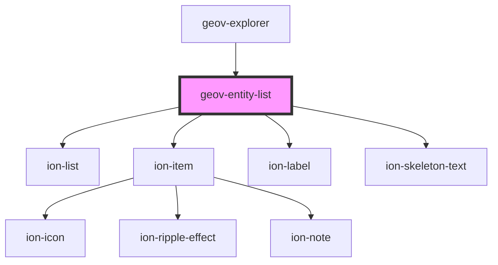

# geov-entity-list

<!-- Auto Generated Below -->

## Properties

| Property          | Attribute           | Description                                                                                                                                                                                                                                                                       | Type                   | Default     |
| ----------------- | ------------------- | --------------------------------------------------------------------------------------------------------------------------------------------------------------------------------------------------------------------------------------------------------------------------------- | ---------------------- | ----------- |
| `defaultPageSize` | `default-page-size` |                                                                                                                                                                                                                                                                                   | `number`               | `5`         |
| `items`           | --                  |                                                                                                                                                                                                                                                                                   | `GeovEntityListItem[]` | `undefined` |
| `loading`         | `loading`           |                                                                                                                                                                                                                                                                                   | `boolean`              | `undefined` |
| `uriRegex`        | `uri-regex`         | uriRegex Optional regex with capturing groups to transform the uri into the desired url. To use together with uriReplace.                                                                                                                                                         | `string`               | `undefined` |
| `uriReplace`      | `uri-replace`       | uriReplace String used to replace the uriRegex.  Example (pseudo code): const uriRegex = (http:\/\/geovistory.org\/)(.*) const uriReplace = "http://dev.geovistory.org/resource/$2?p=123" http://geovistory.org/resource/i54321 => http://dev.geovistory.org/resource/54321?p=123 | `string`               | `undefined` |

## Dependencies

### Used by

 - [geov-explorer](../geov-explorer)

### Depends on

- ion-list
- ion-item
- ion-label
- ion-skeleton-text

### Graph

----------------------------------------------

*Built with [StencilJS](https://stenciljs.com/)*
