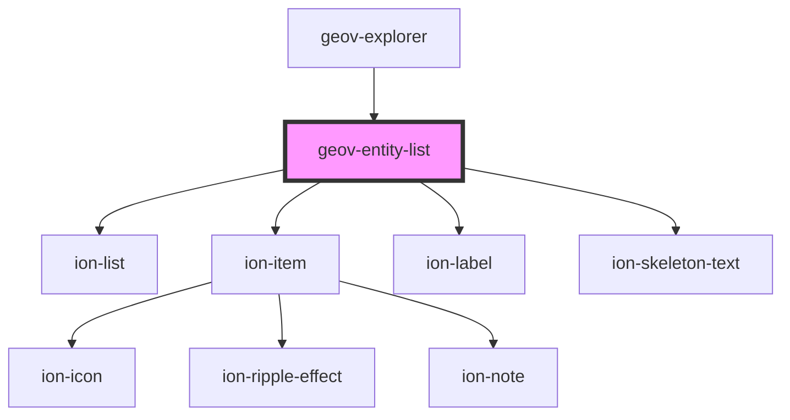

# geov-entity-list

<!-- Auto Generated Below -->

## Properties

| Property          | Attribute           | Description                                                                                                                                                     | Type                   | Default     |
| ----------------- | ------------------- | --------------------------------------------------------------------------------------------------------------------------------------------------------------- | ---------------------- | ----------- |
| `defaultPageSize` | `default-page-size` |                                                                                                                                                                 | `number`               | `5`         |
| `items`           | --                  |                                                                                                                                                                 | `GeovEntityListItem[]` | `undefined` |
| `loading`         | `loading`           |                                                                                                                                                                 | `boolean`              | `undefined` |
| `urlAppend`       | `url-append`        | urlAppend will be appended to the URIs used as links to the geovistory entity pages. Example: '?p=84760' will be redirected to the entity page of project 84760 | `string`               | `''`        |

## Dependencies

### Used by

 - [geov-explorer](../geov-explorer)

### Depends on

- ion-list
- ion-item
- ion-label
- ion-skeleton-text

### Graph

----------------------------------------------

*Built with [StencilJS](https://stenciljs.com/)*
