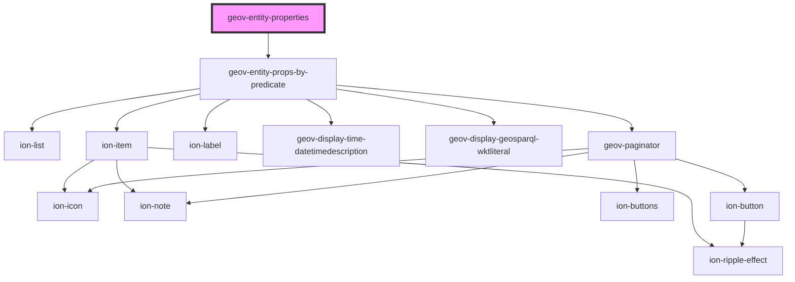

# geov-entity-properties

<!-- Auto Generated Below -->

## Properties

| Property            | Attribute             | Description                                                                     | Type      | Default     |
| ------------------- | --------------------- | ------------------------------------------------------------------------------- | --------- | ----------- |
| `entityId`          | `entity-id`           | entityId ID number of entity, e.g. 'i315800'                                    | `string`  | `undefined` |
| `fetchBeforeRender` | `fetch-before-render` |                                                                                 | `boolean` | `undefined` |
| `language`          | `language`            | language prints the label with the language or english, if not found, e.g. 'en' | `string`  | `'en'`      |
| `sparqlEndpoint`    | `sparql-endpoint`     | sparqlEndpoint URL of the sparql endpoint                                       | `string`  | `undefined` |

## Dependencies

### Depends on

- [geov-entity-props-by-predicate](../geov-entity-props-by-predicate)

### Graph

----------------------------------------------

*Built with [StencilJS](https://stenciljs.com/)*
