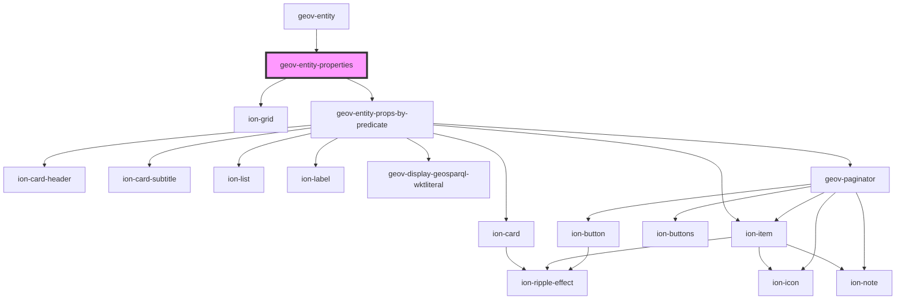

# geov-entity-properties

<!-- Auto Generated Below -->

## Properties

| Property            | Attribute             | Description                                                                                                                                                                                                                                                                       | Type      | Default     |
| ------------------- | --------------------- | --------------------------------------------------------------------------------------------------------------------------------------------------------------------------------------------------------------------------------------------------------------------------------- | --------- | ----------- |
| `_ssrId`            | `_ssr-id`             | declares an _ssrId property that is reflected as attribute                                                                                                                                                                                                                        | `string`  | `undefined` |
| `color`             | `color`               | color Color of the properties                                                                                                                                                                                                                                                     | `string`  | `''`        |
| `entityId`          | `entity-id`           | entityId ID number of entity, e.g. 'i315800'                                                                                                                                                                                                                                      | `string`  | `undefined` |
| `fetchBeforeRender` | `fetch-before-render` |                                                                                                                                                                                                                                                                                   | `boolean` | `true`      |
| `fixedGrid`         | `fixed-grid`          | fixedGrid if true, the content is wrapped in a <ion-grid fixed=true></ion-grid>                                                                                                                                                                                                   | `boolean` | `undefined` |
| `language`          | `language`            | language prints the label with the language or english, if not found, e.g. 'en'                                                                                                                                                                                                   | `string`  | `'en'`      |
| `predicateExclude`  | `predicate-exclude`   | predicateInclude Comma separated list of predicate URI's to exclude, e.g: Don't fetch the rdfs:label and p86i (was born) 'http://www.w3.org/2000/01/rdf-schema#label,https://ontome.net/ontology/p86i'                                                                            | `string`  | `undefined` |
| `predicateInclude`  | `predicate-include`   | predicateInclude Comma separated list of predicate URI's to include, e.g: Fetch only the rdfs:label and p86i (was born) 'http://www.w3.org/2000/01/rdf-schema#label,https://ontome.net/ontology/p86i'                                                                             | `string`  | `undefined` |
| `sparqlEndpoint`    | `sparql-endpoint`     | sparqlEndpoint URL of the sparql endpoint                                                                                                                                                                                                                                         | `string`  | `undefined` |
| `uriRegex`          | `uri-regex`           | uriRegex Optional regex with capturing groups to transform the uri into the desired url. To use together with uriReplace.                                                                                                                                                         | `string`  | `undefined` |
| `uriReplace`        | `uri-replace`         | uriReplace String used to replace the uriRegex.  Example (pseudo code): const uriRegex = (http:\/\/geovistory.org\/)(.*) const uriReplace = "http://dev.geovistory.org/resource/$2?p=123" http://geovistory.org/resource/i54321 => http://dev.geovistory.org/resource/54321?p=123 | `string`  | `undefined` |

## Events

| Event         | Description                              | Type                                    |
| ------------- | ---------------------------------------- | --------------------------------------- |
| `dataFetched` | Emits fetched data, after being fetched. | `CustomEvent<GeovEntityPropertiesData>` |

## Methods

### `fetchData() => Promise<GeovEntityPropertiesData>`

#### Returns

Type: `Promise<GeovEntityPropertiesData>`

## Dependencies

### Used by

 - [geov-entity](../geov-entity)

### Depends on

- ion-grid
- [geov-entity-props-by-predicate](../geov-entity-props-by-predicate)

### Graph

----------------------------------------------

*Built with [StencilJS](https://stenciljs.com/)*
