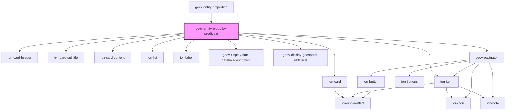

# geov-entity-props-by-predicate

<!-- Auto Generated Below -->

## Properties

| Property            | Attribute             | Description                                                                                                                                                                                                                                                                       | Type      | Default     |
| ------------------- | --------------------- | --------------------------------------------------------------------------------------------------------------------------------------------------------------------------------------------------------------------------------------------------------------------------------- | --------- | ----------- |
| `_ssrId`            | `_ssr-id`             | declares an _ssrId property that is reflected as attribute                                                                                                                                                                                                                        | `string`  | `undefined` |
| `color`             | `color`               |                                                                                                                                                                                                                                                                                   | `string`  | `''`        |
| `entityId`          | `entity-id`           | entityId ID number of entity, e.g. 'iXXX'                                                                                                                                                                                                                                         | `string`  | `undefined` |
| `fetchBeforeRender` | `fetch-before-render` | if true, componentWillLoad() returns a promise for the loading of all data [default: true]                                                                                                                                                                                        | `boolean` | `true`      |
| `language`          | `language`            | language prints the label with the language or english, if not found, e.g. 'en'                                                                                                                                                                                                   | `string`  | `undefined` |
| `pageSize`          | `page-size`           | pageSize Page size if too many resultat for a property, default 3                                                                                                                                                                                                                 | `number`  | `3`         |
| `predicateLabel`    | `predicate-label`     | predicateLabel Label of the predicate                                                                                                                                                                                                                                             | `string`  | `undefined` |
| `predicateUri`      | `predicate-uri`       | predicateUri URI of the predicate                                                                                                                                                                                                                                                 | `string`  | `undefined` |
| `sparqlEndpoint`    | `sparql-endpoint`     | sparqlEndpoint URL of the sparql endpoint                                                                                                                                                                                                                                         | `string`  | `undefined` |
| `totalCount`        | `total-count`         | totalCount Total number of entity from this property                                                                                                                                                                                                                              | `number`  | `undefined` |
| `uriRegex`          | `uri-regex`           | uriRegex Optional regex with capturing groups to transform the uri into the desired url. To use together with uriReplace.                                                                                                                                                         | `string`  | `undefined` |
| `uriReplace`        | `uri-replace`         | uriReplace String used to replace the uriRegex.  Example (pseudo code): const uriRegex = (http:\/\/geovistory.org\/)(.*) const uriReplace = "http://dev.geovistory.org/resource/$2?p=123" http://geovistory.org/resource/i54321 => http://dev.geovistory.org/resource/54321?p=123 | `string`  | `undefined` |

## Events

| Event         | Description                         | Type                     |
| ------------- | ----------------------------------- | ------------------------ |
| `pageChanged` | pageChanged Listener of change page | `CustomEvent<PageEvent>` |

## Dependencies

### Used by

 - [geov-entity-properties](../geov-entity-properties)

### Depends on

- ion-card
- ion-card-header
- ion-card-subtitle
- ion-card-content
- ion-list
- ion-item
- ion-label
- [geov-display-time-datetimedescription](../geov-display-time-datetimedescription)
- [geov-display-geosparql-wktliteral](../geov-display-geosparql-wktliteral)
- [geov-paginator](../geov-paginator)

### Graph

----------------------------------------------

*Built with [StencilJS](https://stenciljs.com/)*
