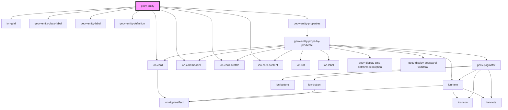

# geov-entity

<!-- Auto Generated Below -->

## Properties

| Property            | Attribute             | Description                                                                     | Type      | Default     |
| ------------------- | --------------------- | ------------------------------------------------------------------------------- | --------- | ----------- |
| `entityId`          | `entity-id`           | entityId ID number of entity, e.g. 'i315800'                                    | `string`  | `undefined` |
| `fetchBeforeRender` | `fetch-before-render` |                                                                                 | `boolean` | `true`      |
| `language`          | `language`            | language prints the label with the language or english, if not found, e.g. 'en' | `string`  | `'en'`      |
| `sparqlEndpoint`    | `sparql-endpoint`     | sparqlEndpoint URL of the sparql endpoint                                       | `string`  | `undefined` |

## Dependencies

### Depends on

- ion-grid
- [geov-entity-class-label](../geov-entity-class-label)
- [geov-entity-label](../geov-entity-label)
- [geov-entity-definition](../geov-entity-definition)
- [geov-entity-properties](../geov-entity-properties)
- ion-card
- ion-card-header
- ion-card-subtitle
- ion-card-content

### Graph

----------------------------------------------

*Built with [StencilJS](https://stenciljs.com/)*
