# geov-explorer

<!-- Auto Generated Below -->

## Properties

| Property            | Attribute             | Description                                                                                                                                                                                                                                                                       | Type      | Default     |
| ------------------- | --------------------- | --------------------------------------------------------------------------------------------------------------------------------------------------------------------------------------------------------------------------------------------------------------------------------- | --------- | ----------- |
| `_ssrId`            | `_ssr-id`             | _ssrId is short for server side rendering id and identifies this component and the fetched data respectively. Set this only if you want to enable this component to fetch serve side                                                                                              | `string`  | `undefined` |
| `fetchBeforeRender` | `fetch-before-render` | If true, the component will not render before the initial data is fetched                                                                                                                                                                                                         | `boolean` | `false`     |
| `initSearchString`  | `init-search-string`  | initialize the component with a given search string                                                                                                                                                                                                                               | `string`  | `undefined` |
| `sparqlEndpoint`    | `sparql-endpoint`     | sparqlEndpoint URL of the sparql endpoint                                                                                                                                                                                                                                         | `string`  | `undefined` |
| `uriRegex`          | `uri-regex`           | uriRegex Optional regex with capturing groups to transform the uri into the desired url. To use together with uriReplace.                                                                                                                                                         | `string`  | `undefined` |
| `uriReplace`        | `uri-replace`         | uriReplace String used to replace the uriRegex.  Example (pseudo code): const uriRegex = (http:\/\/geovistory.org\/)(.*) const uriReplace = "http://dev.geovistory.org/resource/$2?p=123" http://geovistory.org/resource/i54321 => http://dev.geovistory.org/resource/54321?p=123 | `string`  | `undefined` |

## Dependencies

### Depends on

- ion-grid
- ion-row
- ion-col
- ion-searchbar
- [geov-class-select-popup](../geov-class-select-popup)
- ion-note
- ion-skeleton-text
- [geov-class-radio-group](../geov-class-radio-group)
- [geov-entity-list](../geov-entity-list)
- ion-item
- [geov-paginator](../geov-paginator)

### Graph

```mermaid
graph TD;
  geov-explorer --> ion-grid
  geov-explorer --> ion-row
  geov-explorer --> ion-col
  geov-explorer --> ion-searchbar
  geov-explorer --> geov-class-select-popup
  geov-explorer --> ion-note
  geov-explorer --> ion-skeleton-text
  geov-explorer --> geov-class-radio-group
  geov-explorer --> geov-entity-list
  geov-explorer --> ion-item
  geov-explorer --> geov-paginator
  ion-searchbar --> ion-icon
  geov-class-select-popup --> ion-list
  geov-class-select-popup --> ion-item
  geov-class-select-popup --> ion-note
  geov-class-select-popup --> ion-select
  geov-class-select-popup --> ion-select-option
  geov-class-select-popup --> ion-label
  ion-item --> ion-icon
  ion-item --> ion-ripple-effect
  ion-item --> ion-note
  ion-select --> ion-select-popover
  ion-select --> ion-popover
  ion-select --> ion-action-sheet
  ion-select --> ion-alert
  ion-select-popover --> ion-item
  ion-select-popover --> ion-checkbox
  ion-select-popover --> ion-label
  ion-select-popover --> ion-radio-group
  ion-select-popover --> ion-radio
  ion-select-popover --> ion-list
  ion-select-popover --> ion-list-header
  ion-popover --> ion-backdrop
  ion-action-sheet --> ion-backdrop
  ion-action-sheet --> ion-icon
  ion-action-sheet --> ion-ripple-effect
  ion-alert --> ion-ripple-effect
  ion-alert --> ion-backdrop
  geov-class-radio-group --> ion-list
  geov-class-radio-group --> ion-radio-group
  geov-class-radio-group --> ion-item-divider
  geov-class-radio-group --> ion-label
  geov-class-radio-group --> ion-item
  geov-class-radio-group --> ion-note
  geov-class-radio-group --> ion-radio
  geov-class-radio-group --> ion-button
  geov-class-radio-group --> ion-skeleton-text
  ion-button --> ion-ripple-effect
  geov-entity-list --> ion-list
  geov-entity-list --> ion-item
  geov-entity-list --> ion-label
  geov-entity-list --> ion-skeleton-text
  geov-paginator --> ion-item
  geov-paginator --> ion-note
  geov-paginator --> ion-buttons
  geov-paginator --> ion-button
  geov-paginator --> ion-icon
  style geov-explorer fill:#f9f,stroke:#333,stroke-width:4px
```

----------------------------------------------

*Built with [StencilJS](https://stenciljs.com/)*
