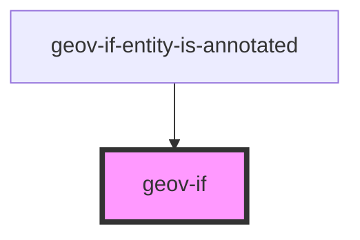

# geov-if


<!-- Auto Generated Below -->


## Properties

| Property         | Attribute         | Description                                                                                                                                                                                                                                                                                                                                                                                                                                                                                                                                     | Type     | Default     |
| ---------------- | ----------------- | ----------------------------------------------------------------------------------------------------------------------------------------------------------------------------------------------------------------------------------------------------------------------------------------------------------------------------------------------------------------------------------------------------------------------------------------------------------------------------------------------------------------------------------------------- | -------- | ----------- |
| `_ssrId`         | `_ssr-id`         |                                                                                                                                                                                                                                                                                                                                                                                                                                                                                                                                                 | `string` | `undefined` |
| `sparqlEndpoint` | `sparql-endpoint` | sparqlEndpoint URL of the sparql endpoint                                                                                                                                                                                                                                                                                                                                                                                                                                                                                                       | `string` | `undefined` |
| `sparqlQuery`    | `sparql-query`    | A sparql query with binding ?condition of type ^^xsd:bolean. If the first ?condition of response is true, the children of the element are rendered, otherwise not.  Example: ```sparql # check if geov:i836507 is annotated entity (ontome:p1875) # of an annotation in text (ontome:p1875) PREFIX ontome: <https://ontome.net/ontology/> PREFIX geov: <http://geovistory.org/resource/>  SELECT  ((count(?subject ) > 0)as ?condition) WHERE {   ?subject ontome:p1875 geov:i836507 .   ?subject a ontome:c933 } GROUP BY ?subject LIMIT 1 ``` | `string` | `undefined` |


## Dependencies

### Used by

 - [geov-if-entity-is-annotated](../geov-if-entity-is-annotated)

### Graph


----------------------------------------------

*Built with [StencilJS](https://stenciljs.com/)*
