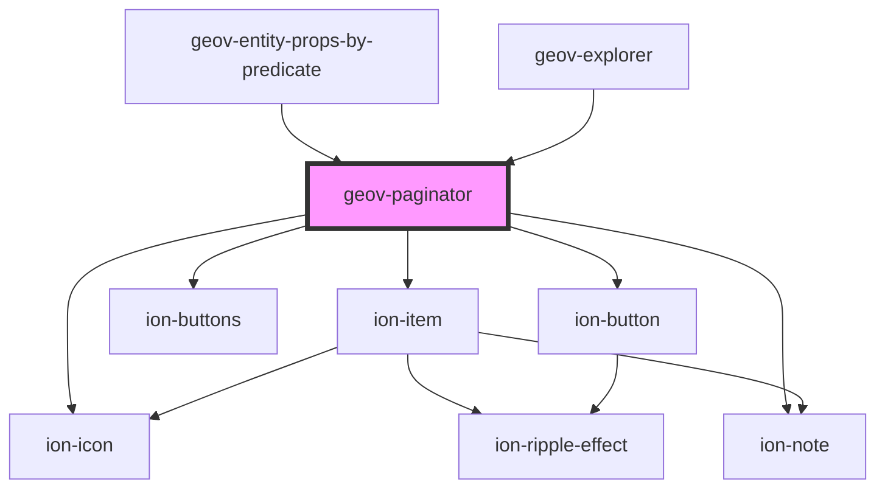

# geov-paginator

<!-- Auto Generated Below -->

## Properties

| Property               | Attribute                 | Description | Type      | Default     |
| ---------------------- | ------------------------- | ----------- | --------- | ----------- |
| `color`                | `color`                   |             | `string`  | `undefined` |
| `hidePageSize`         | `hide-page-size`          |             | `boolean` | `undefined` |
| `length`               | `length`                  |             | `number`  | `0`         |
| `pageIndex`            | `page-index`              |             | `number`  | `0`         |
| `pageSize`             | `page-size`               |             | `number`  | `25`        |
| `showFirstLastButtons` | `show-first-last-buttons` |             | `boolean` | `true`      |

## Events

| Event         | Description | Type                     |
| ------------- | ----------- | ------------------------ |
| `pageChanged` |             | `CustomEvent<PageEvent>` |

## Dependencies

### Used by

 - [geov-entity-props-by-predicate](../geov-entity-props-by-predicate)
 - [geov-explorer](../geov-explorer)

### Depends on

- ion-item
- ion-note
- ion-buttons
- ion-button
- ion-icon

### Graph

----------------------------------------------

*Built with [StencilJS](https://stenciljs.com/)*
