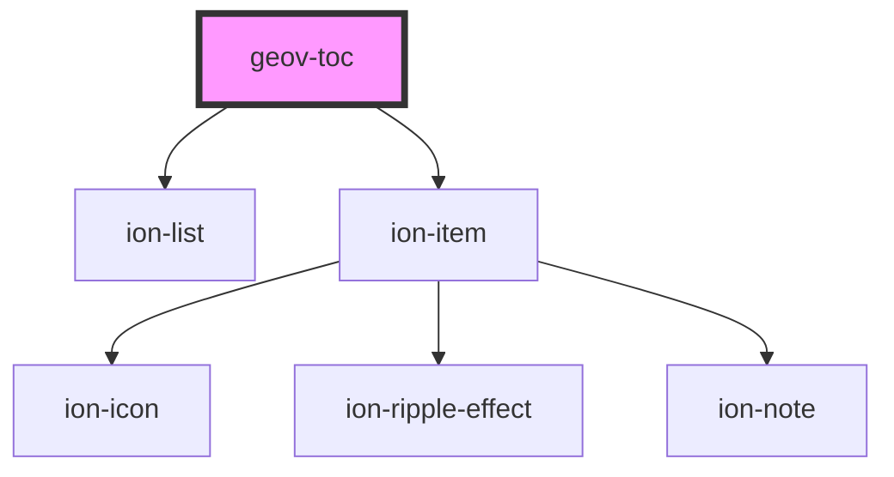

# geov-toc

<!-- Auto Generated Below -->

## Properties

| Property   | Attribute   | Description | Type     | Default |
| ---------- | ----------- | ----------- | -------- | ------- |
| `indentPx` | `indent-px` |             | `number` | `16`    |

## Dependencies

### Depends on

- ion-list
- ion-item

### Graph

----------------------------------------------

*Built with [StencilJS](https://stenciljs.com/)*
