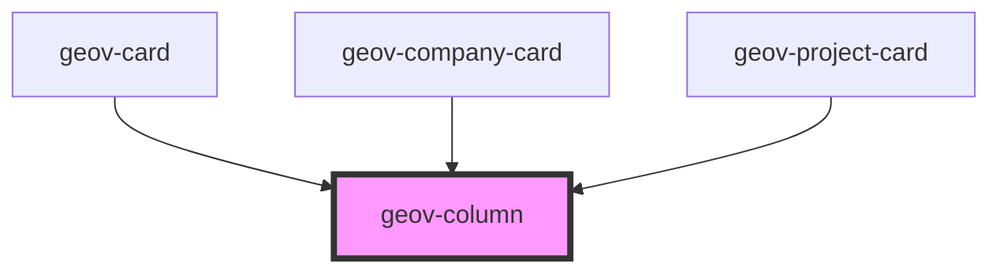

# geov-column

<!-- Auto Generated Below -->

## Properties

| Property  | Attribute | Description | Type                                                                | Default     |
| --------- | --------- | ----------- | ------------------------------------------------------------------- | ----------- |
| `justify` | `justify` |             | `"center" \| "end" \| "space-around" \| "space-between" \| "start"` | `undefined` |

## Dependencies

### Used by

 - [geov-card](../../advanced/geov-card)
 - [geov-company-card](../../advanced/geov-company-card)
 - [geov-project-card](../../advanced/geov-project-card)

### Graph

----------------------------------------------

*Built with [StencilJS](https://stenciljs.com/)*
