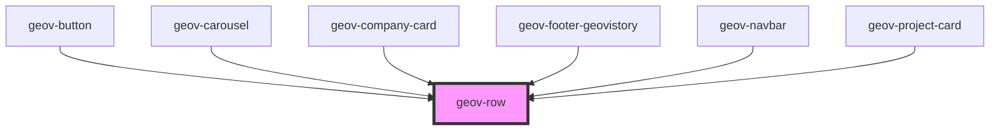

# geov-row

<!-- Auto Generated Below -->

## Properties

| Property       | Attribute       | Description | Type      | Default |
| -------------- | --------------- | ----------- | --------- | ------- |
| `alignCenter`  | `align-center`  |             | `boolean` | `false` |
| `alignEnd`     | `align-end`     |             | `boolean` | `false` |
| `alignStart`   | `align-start`   |             | `boolean` | `false` |
| `center`       | `center`        |             | `boolean` | `false` |
| `end`          | `end`           |             | `boolean` | `false` |
| `fh`           | `fh`            |             | `boolean` | `false` |
| `fw`           | `fw`            |             | `boolean` | `false` |
| `geovStyle`    | `geov-style`    |             | `string`  | `''`    |
| `spaceAround`  | `space-around`  |             | `boolean` | `false` |
| `spaceBetween` | `space-between` |             | `boolean` | `false` |
| `start`        | `start`         |             | `boolean` | `false` |

## Dependencies

### Used by

 - [geov-button](../../basic/geov-button)
 - [geov-carousel](../../advanced/geov-carousel)
 - [geov-company-card](../../advanced/geov-company-card)
 - [geov-footer-geovistory](../../advanced/geov-footer-geovistory)
 - [geov-navbar](../../advanced/geov-navbar)
 - [geov-project-card](../../advanced/geov-project-card)

### Graph

----------------------------------------------

*Built with [StencilJS](https://stenciljs.com/)*
