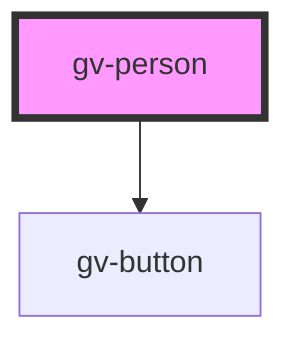

# gv-person

<!-- Auto Generated Below -->

## Properties

| Property    | Attribute   | Description | Type     | Default     |
| ----------- | ----------- | ----------- | -------- | ----------- |
| `birthdate` | `birthdate` |             | `string` | `undefined` |
| `lastname`  | `lastname`  |             | `string` | `undefined` |
| `name`      | `name`      |             | `string` | `undefined` |

## Dependencies

### Depends on

- [gv-button](../../base/gv-button)

### Graph

----------------------------------------------

*Built with [StencilJS](https://stenciljs.com/)*
